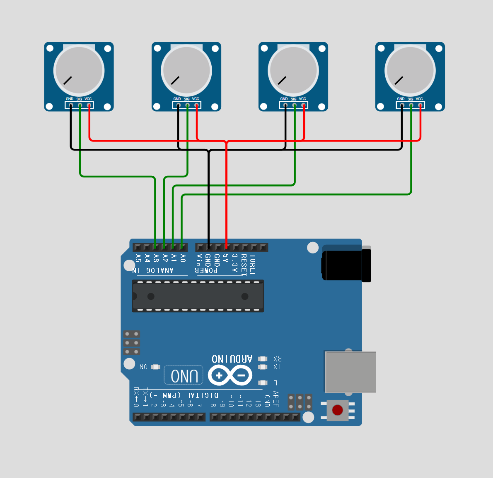
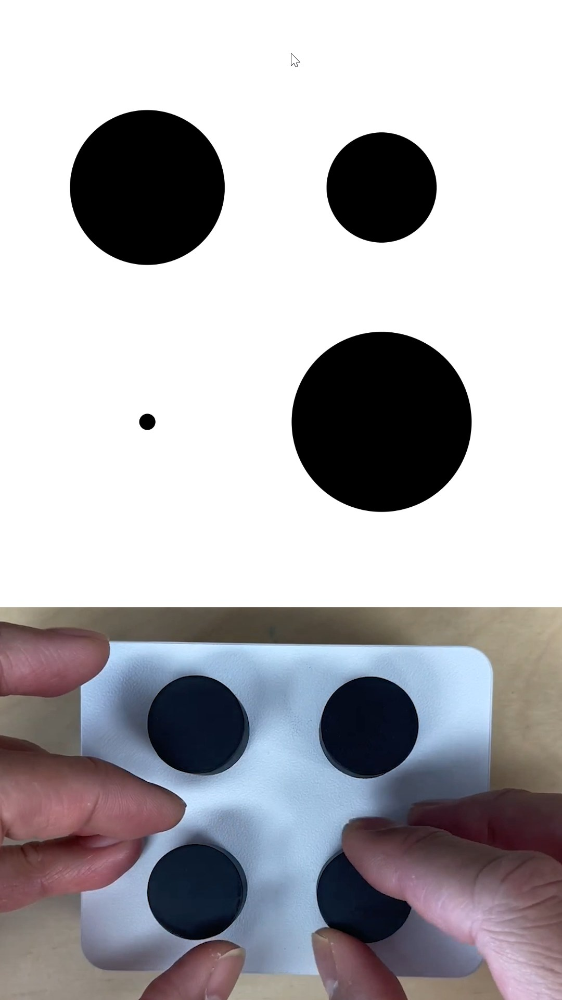

## 🔌 아두이노 회로 꾸미기는 아래처럼 간단하게 구성할 수 있어요
아래 이미지를 참고하여 회로를 구성하세요.
가변저항은 potentiometer 종류면 대부분 동일한 방식으로 작동합니다.
슬라이더를 쓰든 동그란 바(노브)가 있는 타입을 사용하든 동일하다고 생각하면 돼요.

[실행 화면](https://www.instagram.com/reel/DXvhRXDTVTx/?utm_source=ig_web_copy_link&igsh=MzRlODBiNWFlZA==).

## ⚙️ Arduino 코드는 serial 9600baud로 데이터를 내보내는 게 다 입니다.

Arduino 관련 코드는 `arduino_p5_serial` 폴더에 있습니다.
values 라는 배열에 보낼 데이터가 들어갑니다.
values는 0~1023 범위의 값이 들어가요. 
개행문자(엔터, '\n')를 데이터 분리 기준으로 삼습니다.

## 🎨 p5.js 코드는 html과 js, css가 나뉘어 모여있으니 아래 폴더를 참고하세요.

p5.js 관련 코드는 `p5serial` 폴더에 있습니다.

pots 라는 배열이 입력받은 데이터를 담는 그릇이에요

draw 함수에 보면 serial.available()>0 이라는 조건이 걸려있는데, 

그 조건문 안쪽을 보면 시리얼 데이터가 있을 경우에만 pots 라는 배열을 업데이트하는 걸 볼 수 있어요.

데이터의 개수라 4개여야 pots에 데이터를 넣는 조건도 볼 수 있죠.

## 🚀 Getting Started 실행방법

1. `circuit.png`를 참고하여 회로를 구성합니다. 회로에 맞게 가변저항 (potentiometer) 4개를 arduino에 연결합니다.
2. Arduino 코드를 arudni uno에 업로드합니다. 업로드가 다 되었다면 이제 p5 차례.
3. visual studio code에서 open folder를 하고 p5serial폴더를 열어줍니다.
4. live server가 안깔려있다면 깔아주시고, vs code하단의 go live 버튼을 눌러 p5.js 코드를 실행합니다.
5. connect 버튼을 누르면 serial 연결 다이알로그 화면이 뜰거에요. 연결해주면 끝!
